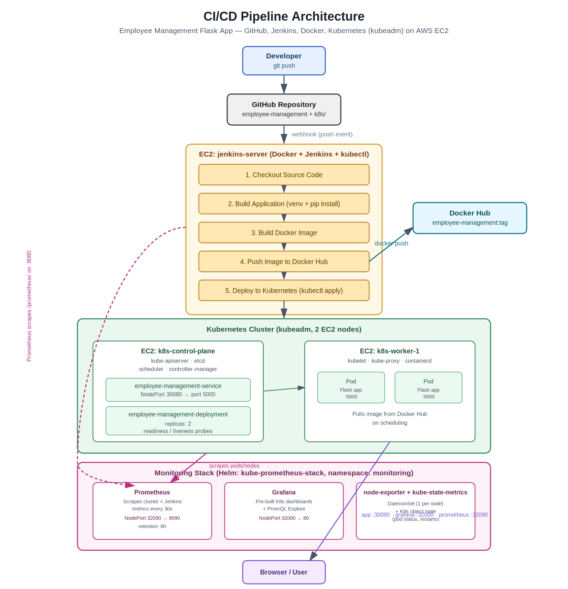

# Employee Management CI/CD Pipeline

End-to-end CI/CD pipeline for a Python Flask web app, using **GitHub → Jenkins → Docker → Kubernetes (kubeadm)** on AWS EC2, with **Prometheus + Grafana** monitoring.

Every push to `main` automatically builds, containerizes, and deploys the app to a Kubernetes cluster — no manual steps required.

## Architecture



```
Developer → git push → GitHub → Webhook → Jenkins
  → Checkout → Build → Docker Build → Push to Docker Hub
  → kubectl apply (Kubernetes) → Rollout Verify
  → Live app on NodePort 30080

Prometheus (scrapes cluster + Jenkins) → Grafana dashboards
```

**Infrastructure:** 3 AWS EC2 instances (Ubuntu 22.04)
| Instance | Role |
|---|---|
| `jenkins-server` | Jenkins + Docker + kubectl |
| `k8s-control-plane` | kubeadm control plane |
| `k8s-worker-1` | kubeadm worker node, runs app pods |

## Tech Stack

- **App:** Python 3, Flask
- **CI/CD:** Jenkins (Declarative Pipeline)
- **Containerization:** Docker
- **Registry:** Docker Hub
- **Orchestration:** Kubernetes (kubeadm, self-managed)
- **Monitoring:** Prometheus + Grafana (via Helm, `kube-prometheus-stack`)
- **Cloud:** AWS EC2

## Project Structure

```
employee-management/
├── app.py               # Flask app
├── requirements.txt
├── Dockerfile
├── Jenkinsfile           # Pipeline definition
├── static/
└── templates/
k8s/
├── deployment.yaml       # 2 replicas, readiness/liveness probes
└── service.yaml          # NodePort 30080
```

## Pipeline Stages

1. **Checkout Source Code** — pull latest commit
2. **Build Application** — install dependencies, validate
3. **Build Docker Image** — tag with build number + `latest`
4. **Push Image to Docker Hub**
5. **Deploy to Kubernetes** — `kubectl apply` + rollout wait
6. **Verify Deployment** — confirm pods/service are healthy

## Setup Summary

1. Provision 3 EC2 instances, open ports `22, 8080, 6443, 2379-2380, 10250-10259, 30000-32767`
2. Install Docker + Jenkins + kubectl on `jenkins-server`
3. Bootstrap kubeadm cluster on control-plane + worker; install Flannel CNI
4. Add Jenkins credentials: `docker-hub-creds` (Docker Hub) and `kubeconfig` (cluster access)
5. Create a Jenkins Pipeline job → Script Path: `employee-management/Jenkinsfile`
6. Add a GitHub webhook → `http://<jenkins-ip>:8080/github-webhook/`
7. Push code → pipeline runs automatically → app live at `http://<worker-ip>:30080`
8. Install monitoring: `helm install monitoring prometheus-community/kube-prometheus-stack -n monitoring --create-namespace -f values.yaml`

## Access

| Service | URL |
|---|---|
| App | `http://<k8s-worker-1-public-ip>:30080` |
| Grafana | `http://<node-public-ip>:32000` (login: `admin`) |
| Prometheus | `http://<node-public-ip>:32090` |

## Monitoring

Prometheus scrapes cluster metrics (via node-exporter + kube-state-metrics) and Jenkins build metrics (via the Jenkins Prometheus plugin, exposed at `/prometheus/`) as an external scrape target. Grafana ships with pre-built Kubernetes dashboards out of the box — no manual dashboard setup needed.

## Deploying Changes

Just push to `main` (via git or the GitHub web UI) — Jenkins builds and redeploys automatically. To roll back a bad deploy:

```bash
kubectl rollout undo deployment/employee-management-deployment
```
